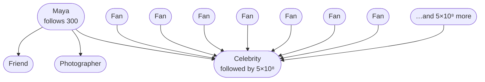
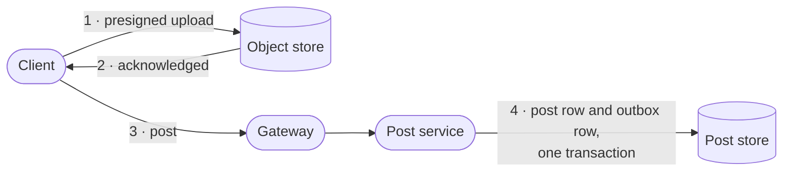
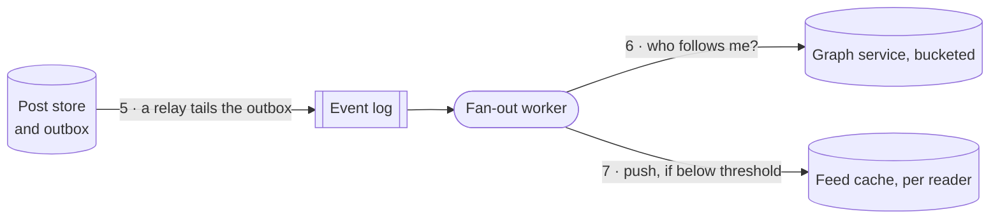
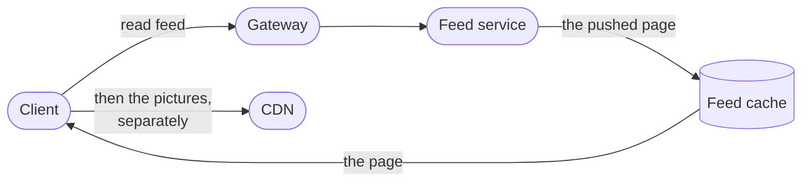
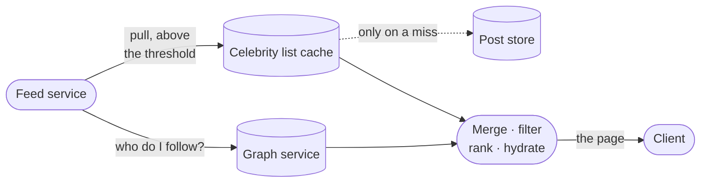
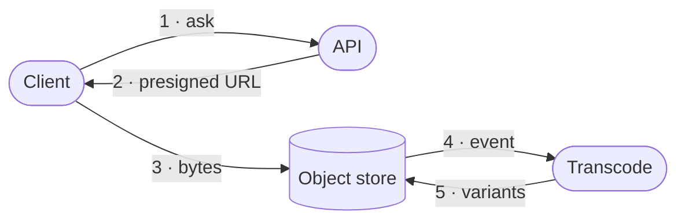
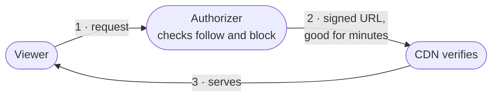

<!-- _class: title silent spectrum -->

# Designing Instagram

`Chapter 11 of 13 · Part five`

The antagonist is not scale. It is the shape of the follow graph, and it forces the hybrid fan-out rather than it being a preference.

---

<!-- _class: agenda progress-6 -->

## Thirteen chapters, gathered into six movements.

1. A Tuesday — one engineer, wake to sleep
2. The words — naming what you just watched
3. Protagonist and antagonist — where a design starts
4. Solution types — which answer is wanted
5. Six kits — data, compute, network, scale, reliability, security
6. Two designs, then the map back — Instagram, a parking app, and what you keep

---

<!-- _class: content -->

`Where this sits`

## Everything from chapters one to ten gets spent here at once.

You fill in a nine-field worksheet before the first box goes on the board, and you discover only the eighth. Capacity is worked from a daily average up to a peak page-fetch rate, and the design’s own fixes are checked back against the promises that motivated them. Read chapters two to four for the vocabulary and the rung, and chapters five to ten for the parts this design reaches for.

---

<!-- _class: divider numbered -->

`Part five`

## Now we design the thing Maya opened while the train sat.

---

<!-- _class: code -->

`Instagram · the worksheet`

## You fill in all of these before the first box, except the eighth. That one you discover.

```text
Protagonist   A reader on a phone. Twelve opens a day, on cellular.
Antagonist    The shape of the follow graph — a tail at 5×10⁸ edges.
Purpose       A fresh, personal, ranked page in under a second.
Boundary      In: feed, posts, edges, media. Out: the phone, the network, the law.
Environment   Evening peak ~2.5x the mean, partitions, duplicate deliveries, people who want in.
Constraints   200 ms p99 · 60 opens per write · media durable forever
Invariants    A post reaches eligible followers · media never lost · a like counts once
Bottleneck    Suspected: filling in each post. Confirm it once the read path exists.
Solution type Scaled. Not an MVP, not optimal.
```

---

<!-- _class: list-criteria -->

`Instagram · what it must do`

## The whole product rests on four operations.

1. Post a photo
   - Upload media, attach a caption, publish it to the people who follow you.
2. Follow an account
   - Build the directed graph that decides whose posts you are eligible to see.
3. Read a feed
   - A ranked, paginated page of recent posts from the accounts you follow.
4. React
   - Like and comment, with counts visible on every post.

---

<!-- _class: list-criteria -->

`Instagram · what it must guarantee`

## What you promise decides the architecture more than what you build.

1. The feed serves in under 200 milliseconds
   - Server-side, 99th percentile, measured from the reader's own region.
2. Reads dominate writes by about sixty to one
   - Counted in opens. Push fan-out nearly erases that underneath: 330K feed writes a second against 420K feed reads.
3. Posts, media and the graph are durable forever
   - Lose any of the three and nothing rebuilds them. Only derived data rebuilds.
4. Eventual consistency is fine on the feed
   - A late post and a lagging count are fine. A blank count is not.

---

<!-- _class: content -->

`Instagram · the estimate, worked`

## Two assumptions and some division give you every number that matters.

Assume 500 million daily users opening the feed twelve times a day, and 100 million photos posted a day. The rest is division. Twelve opens each, times five hundred million people, over the seconds in a day: about `70K` feed opens a second. A hundred million posts over the same day: `1.2K` writes. At two megabytes each: `200 TB` a day. The ratio lands near `60:1`.

One of those numbers does less work than it looks. Change the 500 million, holding opens and posts per person fixed, and the ratio does not move at all.

---

<!-- _class: list-tabular -->

`Instagram · what each number decides`

## Four numbers decide something here. The 500 million users decide nothing.

1. Writes · 1.2 K/s
   - One machine could take the posts. Each one becomes hundreds of feed writes, which is the hard part.
2. Feed opens · 70 K/s
   - The number everyone sizes from, and an open is not a request. The real one comes later.
3. Media · 200 TB a day
   - An object store, not a database. Settled right here.
4. Followers · up to 500 M
   - The only number with no ceiling. Two read paths come from this.

---

<!-- _class: content -->

`Your turn`

## Redo it for a smaller product before you turn the page.

Fifty million daily users, opening the app four times a day, posting two million photos. Work out reads per second, writes per second, and the ratio between them.

Do it now, on paper, in under a minute. Cover the next slide until you have one. The point is not the answer; it is that you can produce one at all, in the meeting where it is being decided.

---

<!-- _class: content -->

`The answer`

## The ratio moved, and the reason it moved is the lesson.

`50M × 4 = 200M reads/day ÷ 86,400 ≈ 2.3K reads/s` · `2M ÷ 86,400 ≈ 23 writes/s` · `ratio ≈ 100:1`

A thirtieth of the read traffic, and the ratio went from 60:1 to 100:1. It moved because you changed both per-person numbers, opens and posts, not how many people there are. The ratio is opens per user divided by posts per user: it survives being wrong about population, never about behavior.

---

<!-- _class: content -->

`Instagram · what the average hides`

## A daily average is not a capacity number, and two multipliers separate them.

Seventy thousand a second counts opens, averaged across a whole day. A fleet serves neither opens nor averages.

An open is a session: the reader scrolls, and every screenful is another fetch. Call it six, which already puts the mean read rate at 420K a second. Traffic is not flat either — the evening peak runs a few times the daily mean. Call it two and a half.

`70K × 6 × 2.5 ≈ 1M page-fetches a second.` Size against that, and write both multipliers next to it. Leaving them out is how a fleet gets built an order of magnitude too small, and this pair is the pair most often left out.

---

<!-- _class: diagram compact -->

`Instagram · the graph`

## The follow graph is directed, and the two directions are not the same size.



> One of these lists fits in a single request. The other does not fit anywhere.

*The number of accounts you follow is capped at 7,500. The number who follow you is capped by nothing. Every hard problem in this design sits on that second number.*

---

<!-- _class: split-panel capstone cat-7 -->
<!-- _header: "" -->

`Instagram · the one sentence`

## Your following list is capped. Your followers list is capped by nothing.

Instagram caps your following list at seven and a half thousand accounts. Nobody limits how many people may follow you. An account on the far end of that second number — hundreds of millions of followers — is called a **super node**, and every hard problem here comes from one.

- Following, per person
  - At most 7,500. A read of that list is one partition and a sorted range.
- Followers, per person
  - About 150 for most people. Five hundred million at the top. A million times apart.
- Everything after this
  - Follows from that asymmetry. Nothing else in the design spans that range.

---

<!-- _class: code -->

`Instagram · the storage`

## The edge is stored twice, because it answers two different questions.

```text
following                              followers
  PK  (source_id)                        PK  (target_id, bucket)
  CK  (target_id)                        CK  (created_at DESC, source_id)
  val bucket, created_at                 the follower list, newest first
  "does A follow B?" is a point read     bucket = hash(source) % B(target)
  capped at 7,500 rows                   B = clamp(followers / 10_000, 1, 512)
```

*The forward edge stores the bucket its reverse row went into. Without that, an unfollow years later cannot find the row to delete: `B` has grown since, so recomputing `hash(source) % B` lands somewhere else. A background job rebuilds the reverse table from the forward edges and repairs any drift.*

---

<!-- _class: cards-stack -->

`Instagram · the number that must not shrink`

## B is a high-water mark on the account, not a live follower count.

- Counts fall, and B does not follow them down
  - Someone unfollows and the count drops. Shrink `B` and every edge in the buckets above it is stranded.
- A fan-out worker reads B fresh
  - Never the cached count on a profile page. A stale `B` scans too few buckets and skips the newest followers.
- The low buckets run heavy
  - Edges written while `B` was small crowd the early buckets, until `B` reaches its cap.

---

<!-- _class: compare-table -->

`Instagram · what each read costs`

## Four of these reads are cheap. The fifth is the whole problem.

| The read | The path | What it costs |
| --- | --- | --- |
| Does A follow B? | `following (A)` then `B` | One point read |
| Who does A follow? | `following (A)` range | 7,500 rows, one partition |
| Who follows B, below the bucket line? | `followers (B, 0)` range | ~10⁴ rows, one partition |
| Follower count | `user_edge_stats` | One point read, cached |
| **Who follows B, celebrity B?** | `followers (B, 0..511)` | **5×10⁸ rows, 512 partitions** |

---

<!-- _class: content -->

`Let us get this wrong`

## Design it the obvious way: when you post, write into every follower's feed.

The reader then does almost nothing. One lookup, one page, no merging, no ranking across sources. It is fast, it is simple, and for an account with two hundred followers it is unambiguously correct: two hundred small writes, and every reader gets a page in a millisecond.

Hold that design in your head. Now a single account with five hundred million followers posts one photograph. Before you turn the page, predict what happens.

---

<!-- _class: split-panel metric -->

`One post, one celebrity`

## 25 GB

Five hundred million feed inserts at roughly fifty bytes each, from a single API call.

- 500 seconds to drain, alone
  - At a million inserts a second with nothing else arriving. Ordinary posts keep coming at 330K, so the real clear is `5×10⁸ / (1M − 330K)`, about thirteen minutes.
- 330K inserts a second
  - The platform's ordinary load: 1.2K posts times a mean fan-out near 280. Totals need the mean. The median is far lower and would halve your estimate.
- 25 minutes of everyone else's work
  - Not a wait — a quantity. One post equals what the whole platform normally produces in twenty-five minutes.

---

<!-- _class: cards-grid four -->

`One super node, four fires`

## Writing 25 GB from one call is only the first thing that breaks.

- The fan-out queue
  - 25 GB of inserts from one call, in front of everybody else's posts.
- The hot partition
  - Unbucketed, those edges are one partition key on one replica set.
- The cache
  - 25 GB of churn evicts the working set of readers who did nothing wrong.
- The thundering herd
  - One cache key, invalidated on publish, missed by a million readers at once.

> A skewed key produces a system where one machine is on fire and the rest are idle.

---

<!-- _class: content -->

`Why the hybrid is forced`

## Neither strategy is wrong. Each one is wrong somewhere.

Pushing costs one write per follower, and the follower count is unbounded. Pulling costs one read per followee, and the followee count is capped at seven and a half thousand. So push is cheap exactly where the unbounded side is small, and pull is cheap exactly where the bounded side is what you walk.

There is a second reason, and it is the better one: a celebrity's recent-posts list is written once and read five hundred million times. Nothing else in the system has a ratio like that.

---

<!-- _class: split-compare -->

`Decision`

## Push below the threshold, pull above it, and merge at read.

The two strategies fail at opposite ends of the same graph, so the design uses each one where the other breaks.

- One strategy for everyone
  - Simple to explain, guaranteed to fail at one end. Push drowns on celebrities; pull costs hundreds of reads per page for everyone else.
- Split at the threshold
  - Ordinary posts land in a page that is already built; the celebrities she follows are fetched on demand and merged in, so no writer ever fans out to millions. The read costs one lookup plus the celebrity pulls.

> No tuning survives one writer fanning out to five hundred million. That is what sets the line.

---

<!-- _class: content -->

`Instagram · the threshold`

## Fifty thousand followers is the line, and the honest predicate is a rate.

Fifty thousand puts a fraction of a percent of accounts on the pull path, yet someone following three hundred typically has ten to thirty above it — the accounts a person picks are not a random sample.

Thirty pulls at a one-percent slow call puts the page in trouble, so **cap the pulls at twenty**. Which twenty is the harder question, because nothing on the read path knows when each celebrity last posted.

The better predicate is fan-out work per day, and it is a product of two numbers rather than one.

---

<!-- _class: compare-table -->

`Instagram · the honest predicate`

## A follower count is a proxy. The work is followers times how often they post.

| Account | Followers | How often they post | Fan-out writes a day |
| --- | --- | --- | --- |
| The busy mid-size one | 50,000 | Forty times a day | **2,000,000** |
| The bigger quiet one | 200,000 | Once a week | **28,600** |

The smaller account costs seventy times more, and a follower count on its own cannot tell you that. Both numbers are the same multiplication; only one of the two factors is the one everybody quotes.

---

<!-- _class: split-panel proof cat-6 -->
<!-- _header: "" -->

`Instagram · checking the fix`

## Capping the pulls at twenty does not meet the promise it was chosen to meet.

At thirty pulls and a one-percent slow call, `1 - 0.99^30` puts twenty-six percent of pages on a slow dependency. Cap at twenty and it is eighteen percent — still eighteen times a 99th-percentile budget. The cap sounded like the answer and fails its own arithmetic, which is exactly why you run the check on your own fixes.

- The cache is what bounds it
  - Those pulls hit a cache, so their slow rate is far below one percent — measure it rather than assuming, because at 0.2 percent twenty pulls are still four percent of pages.
- The deadline is the backstop
  - Fire every pull, render at eighty milliseconds with whatever arrived, and let the stragglers land on the next fetch.
- A cap still costs someone
  - A reader following seven and a half thousand accounts can have hundreds above the line. For them twenty is not trimming the quietest — it is most of their pull path.

---

<!-- _class: split-panel capstone cat-8 -->
<!-- _header: "" -->

`Instagram · the hinge`

## The celebrity is a protagonist of the product and the antagonist of your design.

The product exists partly for her. She is the reason a hundred million people opened the app this morning, and the reason the write path cannot be one code path. Both things are true at once, and holding both is what designing feels like.

- For the product
  - She is the most valuable account on the platform, and she must post instantly.
- For the design
  - She is a five-hundred-million-edge node that breaks every uniform assumption.
- What you do about it
  - You do not resolve the tension. You build a second path and name why it exists.

---

<!-- _class: diagram compact -->

`Instagram · the write path`

## A post is not announced until its bytes are acknowledged.



> Step 3 comes after step 2 on purpose. Publish first and the post exists without its picture.

*Transcoding may still be running — a variant that is not ready falls back to the original — but the original must be there before anybody is told the post exists.*

---

<!-- _class: diagram compact -->

`Instagram · out to the followers`

## The graph service is the box everyone forgets to draw.



> Steps 4 and 5 commit together. Two separate writes let one crash leave a post that exists and reaches nobody.

---

<!-- _class: diagram compact -->

`Instagram · the read path`

## For almost everybody, reading the feed is one lookup.



> The page is already sitting there, because somebody wrote it at post time.

---

<!-- _class: diagram compact -->

`Instagram · the read path, above the line`

## A celebrity in your feed is what turns one lookup into four.



> The merge runs after the gather, never beside it.

*The pull goes through a cache, not straight to the store. That box is the whole reason the hybrid is affordable: one celebrity's recent-posts list is written once and read five hundred million times, so it is the most cacheable object in the system.*

---

<!-- _class: list-steps -->

`Instagram · assembling a page`

## Hydration costs more than the other three stages together.

1. Fetch and merge
   - Read the precomputed page, then pull recent posts from the celebrities she follows.
2. Filter
   - Drop blocked accounts, deleted posts and private accounts she does not follow.
3. Rank
   - Score the candidates. Paginate on a stable key, never on the score.
4. Hydrate
   - Fetch each post, its media URLs, its counts, and whether she already liked it.

---

<!-- _class: content -->

`The number we missed`

## Every page you serve is eighty lookups behind it, so the read number is eighty million a second.

A twenty-item page needs four lookups an item — the post row, the media variants, the counts, and whether this reader liked it. Eighty a page, against the million page-fetches a second the peak estimate gave you, is eighty million.

That is the number the worksheet left open, and it is larger than every number on it.

---

<!-- _class: content -->

`The number behind that number`

## Eighty million is rows. The number you size a fleet from is calls.

Batch the four lookups across the whole page and a page costs four calls, not eighty. Four million calls a second against eighty million rows. Rows are the work; calls are what your services receive, and sizing a fleet from the wrong one is a twentyfold mistake.

Do not fold the count into the feed entry; it is written at post time, when the count is zero. Fold the like check at read time: one batched read across the twenty candidates.

Batching is not only about throughput. Eighty parallel calls put fifty-five percent of pages on a slow dependency — that is `1 - 0.99^80`, against a 99th-percentile promise.

---

<!-- _class: split-panel proof cat-1 -->
<!-- _header: "" -->

`Instagram · the likely bug`

## Your own post must appear instantly, or people think the upload failed.

The feed is eventually consistent, which is correct for everyone else's posts and completely wrong for your own. A person who posts and does not see it reads that as data loss, not as staleness, and posts again.

- Where it comes from
  - Read-your-writes, the consistency level from Part four, applied to one reader's own posts.
- Write your own feed synchronously
  - Inside the POST request, before it returns. One extra write, on one key.
- And let the client help
  - It inserts the post it just created optimistically, and reconciles on the next fetch.

---

<!-- _class: diagram compact -->

`Instagram · the upload`

## Media never touches your API servers.



> Step 2 is the only place an untrusted client writes straight into your storage.

*So the grant names the exact key it may write. Let the client choose the key and it writes over somebody else's media. It carries four limits besides: one content type, a size ceiling, a short expiry, and a rate per account. Without those four, anyone can fill your storage at your expense, and step 4 hands bytes they chose to an image decoder.*

---

<!-- _class: diagram compact -->

`Instagram · serving it back`

## A private photo needs a link that expires.



> The authorizer decides once. After that the CDN only checks a signature, and the link outlives that decision.

---

<!-- _class: content -->

`Instagram · what video changes`

## One number in this design assumed a two-megabyte photo.

A phone uploads video in parts, because one request that dies at ninety percent would otherwise start over. So the presigned grant covers a multi-part upload rather than a single PUT.

Transcoding stops being "make a few sizes" and becomes a ladder of bitrates cut into short segments, so a player can step down when the signal weakens. The CDN then serves thousands of small objects per video instead of one.

The fallback goes too. You can serve a photo at full size while its variant renders; you cannot serve a source video, so the post stays unreadable until one rendition finishes. And the 200 TB a day becomes petabytes, where "durable forever" starts to cost real money.

---

<!-- _class: split-panel proof cat-4 -->
<!-- _header: "" -->

`Instagram · the path nobody designs`

## A million likes on one post is the follower list again, on a different axis.

Every like is a write against the same post id — one key, one partition, one leader — arriving tens of thousands a second. That is the hot spot the data kit warned about, and the queue will sometimes deliver the same like twice.

- The row is the truth
  - Store the pair once, keyed by reader and post. The count is an aggregate you rebuild from it, which is what survives a redelivery or an unlike.
- Shard the hot counter only
  - Increment a random one of a hundred sibling keys, but only when the row insert actually created a row. A blind increment double-counts every redelivery, forever.
- Comments are the second unbounded list
  - Bounded per reader, unbounded per post. Page them; never load them with the post.

---

<!-- _class: cards-grid four -->

`Instagram · the changes nobody draws`

## Every design gets drawn at rest. These four happen while it is running.

- A new follow
  - Their earlier posts fanned out before you followed them. Backfill a few, or state the gap.
- An unfollow
  - Pushed entries do not remove themselves. Filter at read against the current edge.
- The same post twice
  - A crossed threshold leaves it in the pushed page and in the pull. Dedupe at the merge.
- A cold celebrity key
  - A million readers miss it at once. Serve them one refill, not a million reads.

> A feed is a cache of a relationship. Change the relationship, leave the cache, and the reader sees a lie.

---

<!-- _class: cards-grid four -->

`Instagram · where it breaks`

## Three of these are certainties and one is only likely. Each already has its answer.

- Celebrity post
  - The fan-out queue floods. Answer: the pull path above the threshold.
- Feed cache eviction
  - Cold readers cost a rebuild. Answer: the same render deadline, then rebuild behind the request.
- Redelivery
  - The queue delivers twice. Answer: the feed entry is keyed on reader and post.
- Zone loss
  - A whole zone disappears. Answer: media replicated, every derived store rebuildable.

---

<!-- _class: checklist -->

`Instagram · the invariants`

## Six sentences have to hold, or the design is not finished.

- [ ] A post is visible to every eligible follower who reaches it — except past the pull cap, where ten of your celebrities are dropped on every page. `order the cap, rotate it, or say it out loud`
- [x] Media is never lost once an upload is acknowledged. `durable`
- [x] A like counts exactly once per reader and post. `idempotent`
- [x] A feed page never repeats or skips an item. `stable cursor + dedupe at merge`
- [ ] A blocked account is filtered at read — but a signed media URL outlives the check. `keep the TTL short`
- [x] Every derived store rebuilds from posts and edges. `rebuildable`

---

<!-- _class: closing silent spectrum -->

## One design, at the top of the ladder.

`Chapter 11 of 13 · How to Think About Systems`

Chapter twelve runs the same method from nothing, on a parking app you could ship this month, where the card fee turns out to be the bill and the servers never were.
