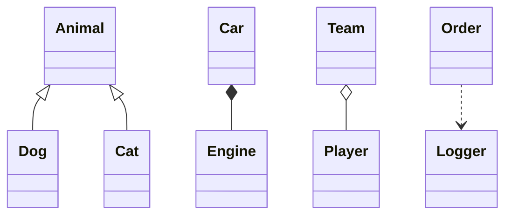
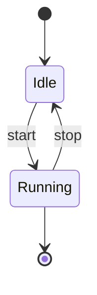
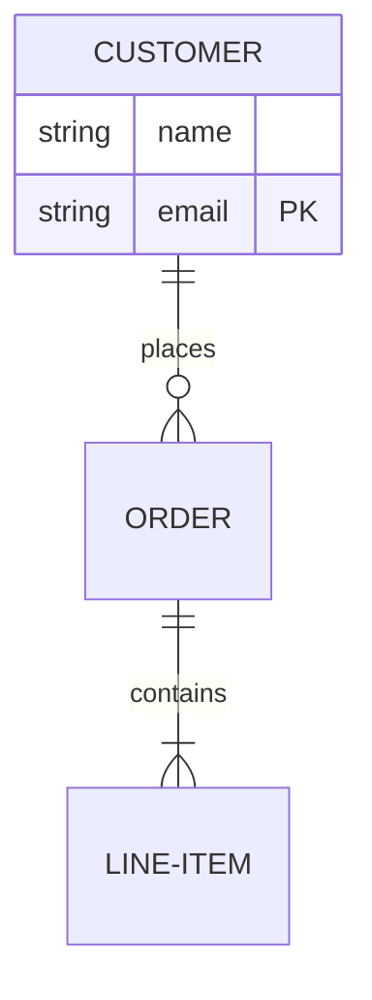
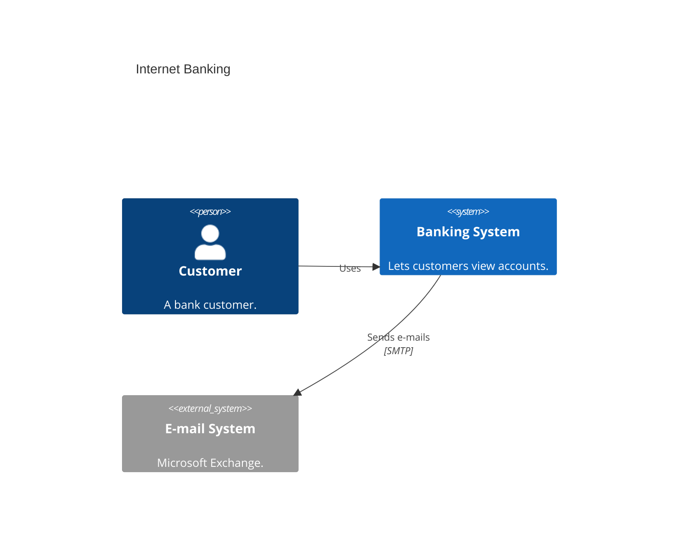
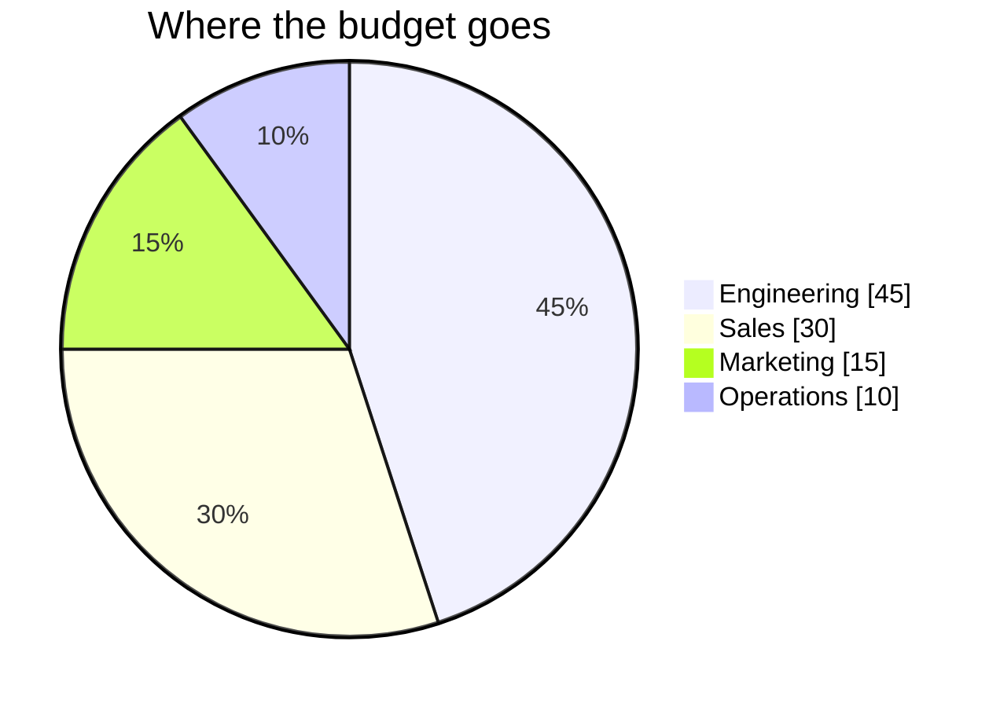
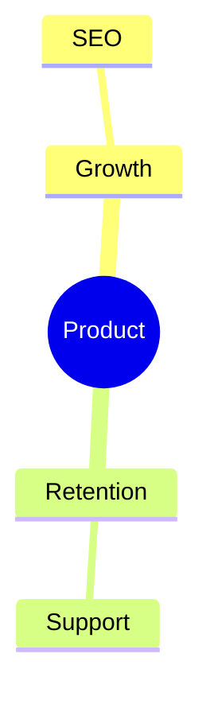

<!-- _class: title -->
<!-- _paginate: false -->
<!-- _footer: '' -->
<!-- _header: '' -->

# Read-aloud that reads the model.

`Mermaid class · state · ER · C4 · pie narration`

*Read-aloud narrated flowcharts, then the sequence message script. Now it reads the rest of the first wave — the typed-relationship diagrams. Their power is the faithfulness asymmetry: a class arrow, an ER crow's-foot, a C4 `Rel` all have a **Mermaid-defined** meaning, so speaking that meaning is reading the author's choice, not inventing one (design 2026-07-14, first-wave slice #2).*

---

<!-- _class: diagram -->

`01 · classDiagram`

## The symbol IS the verb.

> A flowchart arrow reads a neutral "leads to" because its meaning isn't authored. A class arrow is different: `<|--` is *defined* as inheritance, `*--` as composition, `o--` as aggregation, `..>` as dependency. So the reading speaks the defined verb, in the right direction: "Dog inherits from Animal. Cat inherits from Animal. Car is composed of Engine. Team aggregates Player. Order depends on Logger." A relationship label overrides the verb; a `"1" --> "*"` multiplicity trails as "one to many."

---

<!-- _class: diagram -->

`02 · stateDiagram`

## Start and end are read from position.

> `[*]` is the start or end by *where it sits* — a source is the entry, a target is the exit. Each transition reads its authored event: "It starts at Idle. From Idle, on start, goes to Running. From Running, on stop, goes to Idle. Running can end." A composite `state X { … }`, a `--` concurrency divider, or a `<<fork>>` bails to the heading — a flat reading would misstate parallel or nested structure.

---

<!-- _class: diagram -->

`03 · erDiagram`

## Both cardinalities, read literally.

> The crow's-foot counts are Mermaid-defined, so the reading transcribes *both* — never gambling a single direction: "One CUSTOMER places zero or more ORDER. One ORDER contains one or more LINE-ITEM." An attribute block reads its fields and their key roles: "CUSTOMER has attributes name and email as the primary key."

---

<!-- _class: diagram -->

`04 · C4`

## Typed people, systems, and their relationships.

> Each element reads its kind and description: "Customer, a person: A bank customer. Banking System, a system: Lets customers view accounts. E-mail System, an external system: Microsoft Exchange." — "external" is spoken only on an `_Ext` element. A `Rel` reads its authored label and direction, honoring `Rel_Back` and ignoring the `_U/_D/_L/_R` layout hints: "Customer Uses Banking System. Banking System Sends e-mails E-mail System, over SMTP."

---

<!-- _class: diagram -->

`05 · pie`

## The percentage, derived the way Mermaid derives it.

> A pie chart's share is a value Mermaid itself computes and shows, so speaking it is faithful, not invented: "A pie chart, Where the budget goes. Engineering, forty-five, forty-five percent. Sales, thirty, thirty percent. Marketing, fifteen, fifteen percent. Operations, ten, ten percent." (`showData` speaks the raw value alongside the share.) A chart with fewer than two slices, or a non-positive total, bails.

---

<!-- _class: diagram -->

`06 · Honest bail`

## What isn't in the first wave reads its heading.

> mindmap, gantt, timeline, journey, quadrant, and the rest fall back to the slide's heading and this caption for now — exactly as before. Each graduates in its own later slice, under the same rule: read the author's defined meaning faithfully, or say nothing.

---

<!-- _class: closing -->
<!-- _footer: '' -->

# The model is spoken now.

`class · state · ER · C4 · pie · every defined symbol read as the author's verb`
