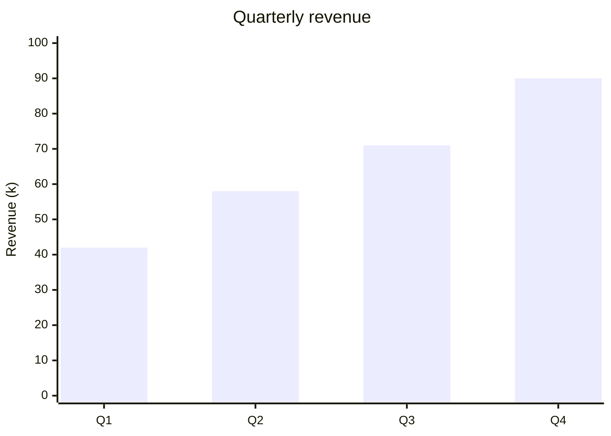
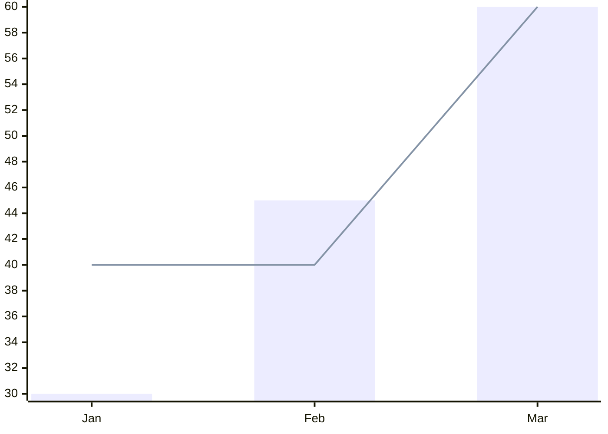
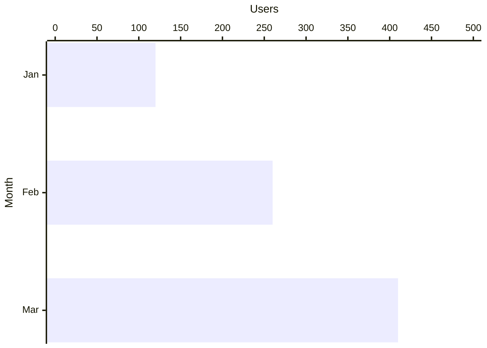
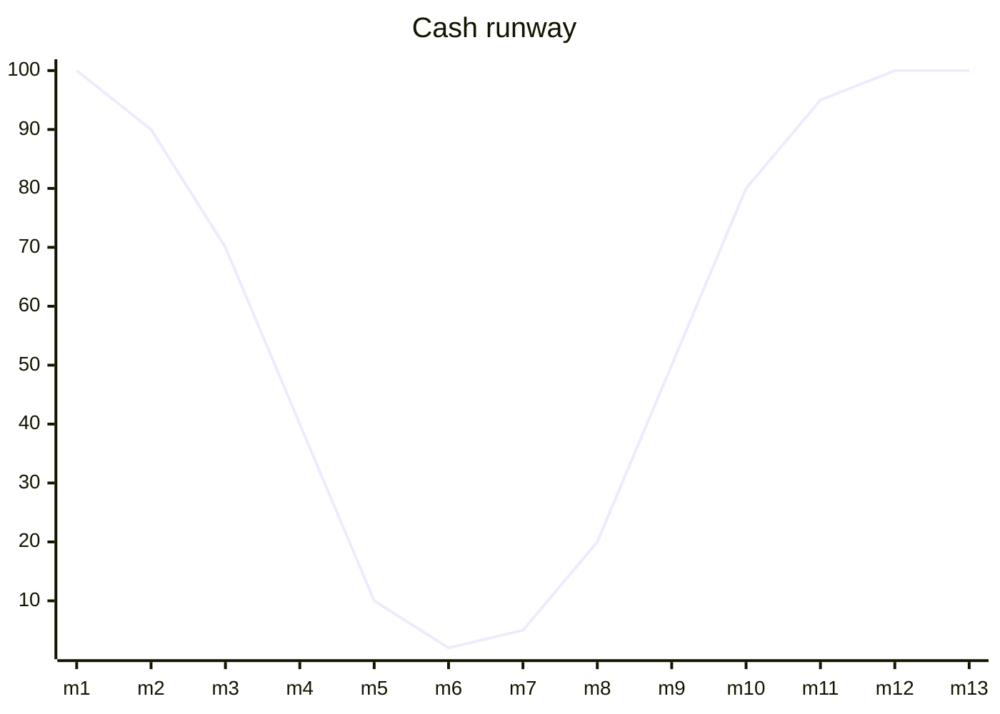
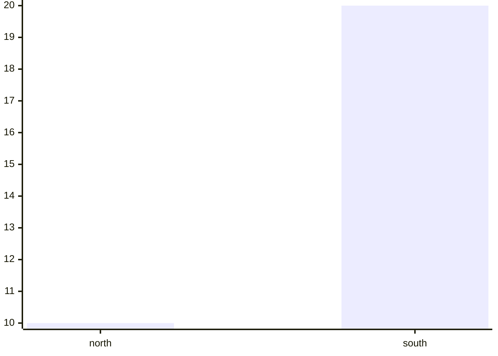

<!-- _class: title -->
<!-- _paginate: false -->
<!-- _footer: '' -->
<!-- _header: '' -->

# Read-aloud that reads the bars.

`Mermaid xychart-beta narration`

*The first tier-2 Mermaid type. An xychart's meaning is its authored values on named axes — so read-aloud names the chart, states the scale the author set, and reads each series' value against its x category, exactly as the chart plots them (design 2026-07-15 §18).*

---

<!-- _class: diagram -->

`01 · A value on every category`

## Each bar reads against its label.



> The reading names the chart, states the scale the author set, then walks each value against its category: "A bar chart, Quarterly revenue. The y-axis, Revenue, runs zero to one hundred. The bar series: Q1, forty-two; Q2, fifty-eight; Q3, seventy-one; Q4, ninety."

---

<!-- _class: diagram -->

`02 · Bars and lines, each named`

## A titled series speaks its own name.



> When a series carries a title, the reading uses it — "The Actual series…", "The Target series…" — so a listener can tell the plotted bars from the goal line by name, not by guessing which came first. Both are read against the same months.

---

<!-- _class: diagram -->

`03 · The scale the author set`

## Axes read by role, never by direction.



> A `horizontal` chart swaps the bars visually, so the reading never says "horizontal" or "vertical" — those flip. It names each axis by its fixed role: "The x-axis is Month. The y-axis, Users, runs zero to five hundred." The values still pair to their months, whichever way the bars point.

---

<!-- _class: diagram -->

`04 · When it's a lot`

## A long line becomes its shape.



> Thirteen values read one after another would drown a listener — and a single "peaks at one hundred" would hide the crash to two that is the whole story. So past a dozen points the reading gives the *shape*: "A line chart, Cash runway, summarizing thirteen points. The line series starts at one hundred, ends at one hundred, with a high of one hundred at m1, m12, and m13 and a low of two at m6." The trough is never lost.

---

<!-- _class: diagram -->

`05 · A numeric axis, still anchored`

## Values on a range get "point" anchors.

```mermaid
xychart-beta
  x-axis "Trial" 1 --> 5
  y-axis "Score" 0 --> 10
  line [3, 6, 5, 8, 9]
```

> When the x-axis is a numeric range rather than a list of labels, each value would otherwise read as a bare number with nothing to hold onto. So the reading anchors every one to its position: "The line series: point one, three; point two, six; point three, five; point four, eight; point five, nine."

---

<!-- _class: diagram -->

`06 · Honest bail`

## A chart it can't read faithfully, it doesn't guess.



> A small, well-formed chart reads in full — "The bar series: north, ten; south, twenty." But when the source is one Mermaid itself won't draw — an empty axis, a malformed range, a stray comma — the slide falls back to its heading rather than narrate a chart that never rendered. No value is ever read against the wrong label.

---

<!-- _class: closing -->
<!-- _footer: '' -->

# The bars are spoken now.

`xychart-beta · chart kind + axes + per-series values · categorical or numeric · read-aloud + exported captions`
