<!-- galleryAuthored: curated Mermaid tour with chart-synergy handoff; tools/build-bucket-galleries.js reads this .md verbatim and will not overwrite it -->
<!-- _class: title silent -->

# Diagrams

`Graph substance · fourteen Mermaid types`

When the relationship between things is the message — flow, structure, hierarchy, cause. These are the shapes only a graph renderer draws; anything quantitative has a native chart, and this deck says which.

---

<!-- _class: split-panel -->
<!-- _footer: "orientation · diagram survey" -->

`How to read this deck`

## Relationships, not quantities.

One product told two ways: the chart family plots its data, this deck maps its structure — the same Decision Framework, seen as a graph.

- Reach for a diagram when the edges carry meaning
  - A flowchart's arrows, an ER diagram's cardinality — the connections are the content, not decoration.
- Let the diagram own at least half the slide
  - If the heading dominates and the graph is a sidebar, it is a prose slide with a picture.
- The palette drives every stroke automatically
  - Mermaid pre-renders to SVG with theme tokens injected — dark and accent variants come free.
- Quantitative shapes defer to charts
  - Plans, proportions, positions, boards, and state machines each have a native chart — the last slide maps them.

---

<!-- _class: divider -->
<!-- _paginate: false -->
<!-- _footer: '' -->

`Group 01 · Flow & sequence`

## How work moves through the system.

---

<!-- _class: diagram -->
<!-- _footer: "flowchart · diagram survey" -->

`Flow & sequence · Flowchart`

## How a raw signal becomes a logged decision.

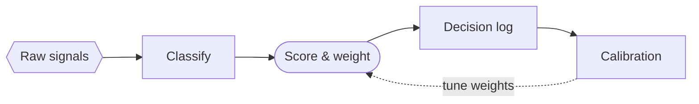

---

<!-- _class: diagram -->
<!-- _footer: "sequence · diagram survey" -->

`Flow & sequence · Sequence`

## The score-and-decide handshake, actor by actor.

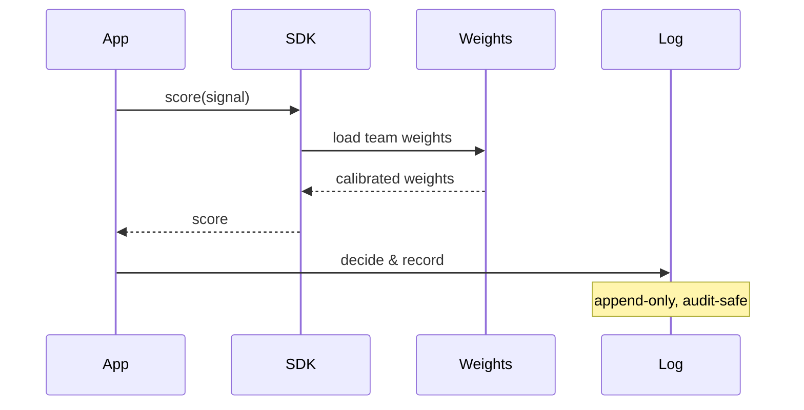

---

<!-- _class: diagram -->
<!-- _footer: "sankey · diagram survey" -->

`Flow & sequence · Sankey`

## Where a thousand signals actually end up.

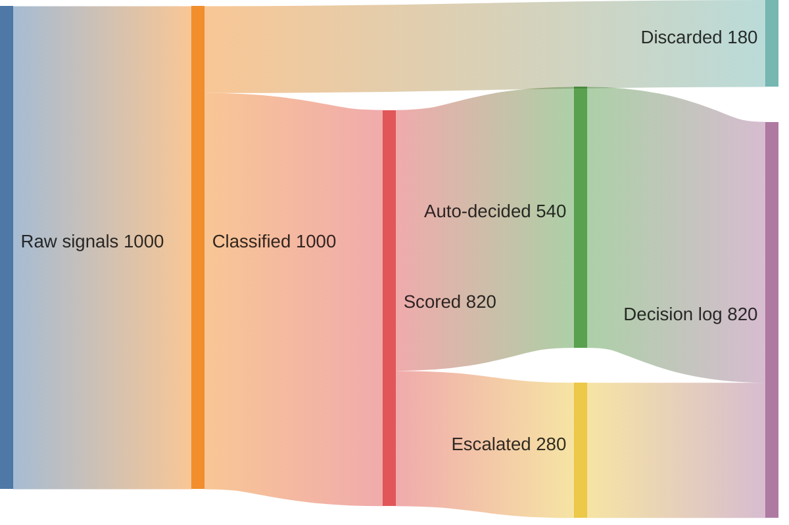

---

<!-- _class: divider -->
<!-- _paginate: false -->
<!-- _footer: '' -->

`Group 02 · Structure & schema`

## The shape of the data and the code.

---

<!-- _class: diagram -->
<!-- _footer: "class · diagram survey" -->

`Structure & schema · Class`

## The scoring engine as an object model.

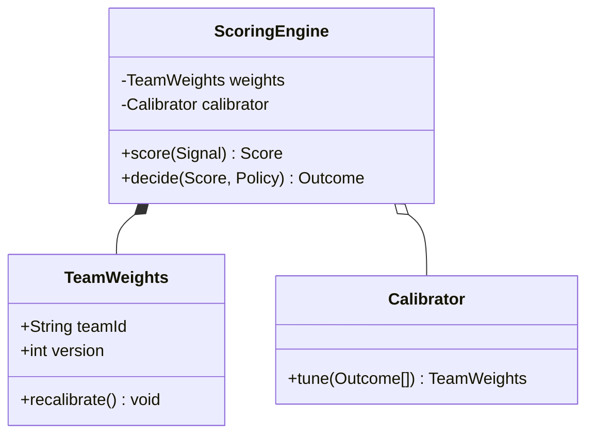

---

<!-- _class: diagram -->
<!-- _footer: "entity-relationship · diagram survey" -->

`Structure & schema · Entity relationship`

## The decision log, table by table.

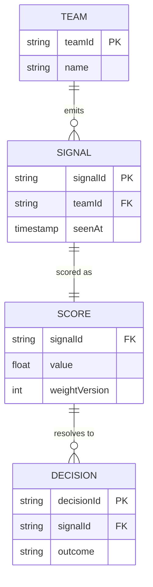

---

<!-- _class: diagram -->
<!-- _footer: "requirement · diagram survey" -->

`Structure & schema · Requirement`

## What the audit demands, traced to what satisfies it.

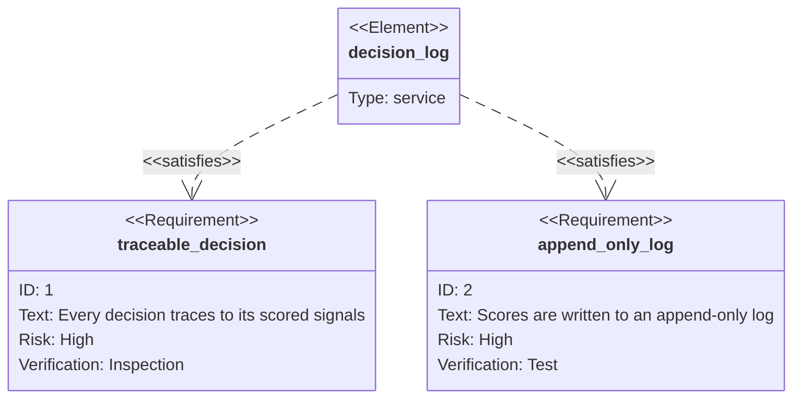

---

<!-- _class: diagram -->
<!-- _footer: "packet · diagram survey" -->

`Structure & schema · Packet`

## One decision-log record, field by bit.

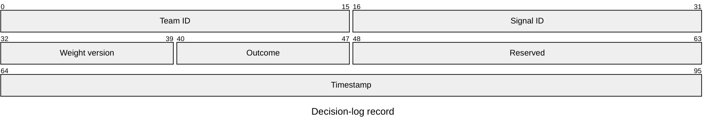

---

<!-- _class: divider -->
<!-- _paginate: false -->
<!-- _footer: '' -->

`Group 03 · Hierarchy & systems`

## Wholes broken into parts, and parts wired together.

---

<!-- _class: diagram -->
<!-- _footer: "mindmap · diagram survey" -->

`Hierarchy & systems · Mindmap`

## The whole framework, decomposed on one canvas.

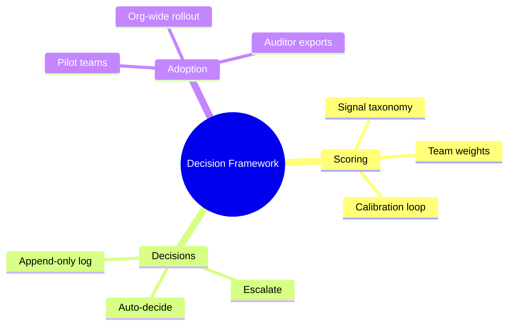

---

<!-- _class: diagram -->
<!-- _footer: "tree · diagram survey" -->

`Hierarchy & systems · Tree`

## The SDK repository, folder by folder.

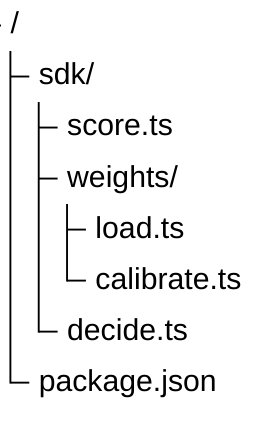

---

<!-- _class: diagram -->
<!-- _footer: "architecture · diagram survey" -->

`Hierarchy & systems · Architecture`

## The same system, as deployed services.

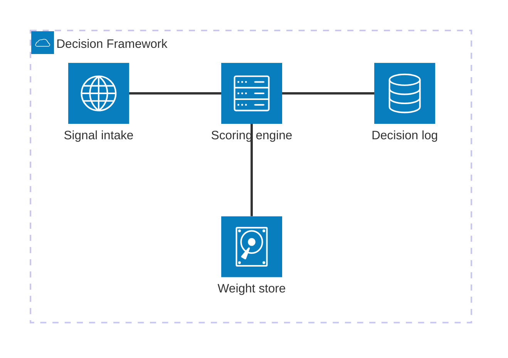

---

<!-- _class: diagram -->
<!-- _footer: "c4 context · diagram survey" -->

`Hierarchy & systems · C4 context`

## Who touches the framework, and how.

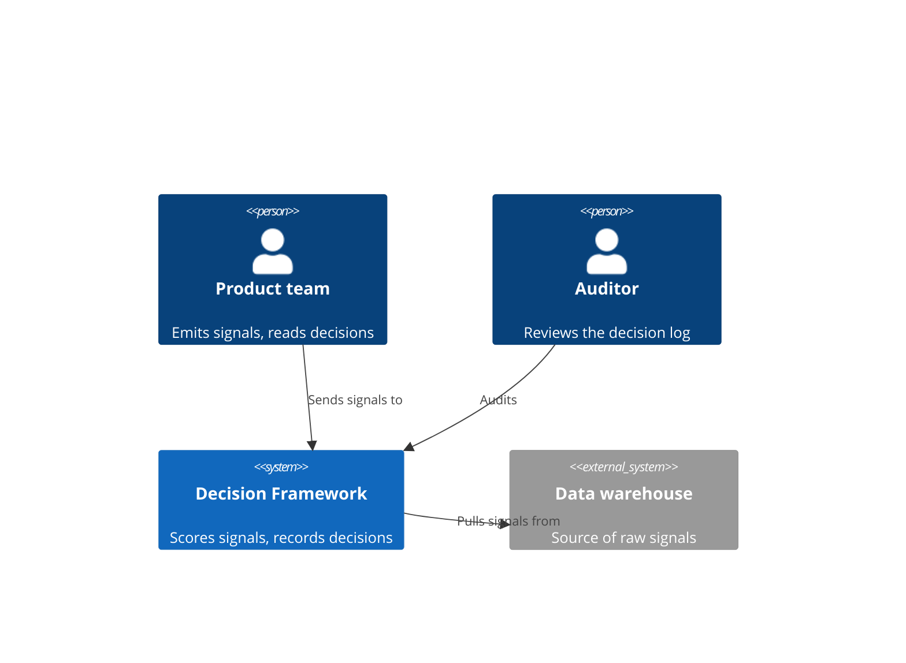

---

<!-- _class: divider -->
<!-- _paginate: false -->
<!-- _footer: '' -->

`Group 04 · Cause, set & history`

## Why something happened, what overlaps, and what shipped.

---

<!-- _class: diagram -->
<!-- _footer: "ishikawa · diagram survey" -->

`Cause, set & history · Ishikawa`

## Why per-team weighting stalled — the fishbone.

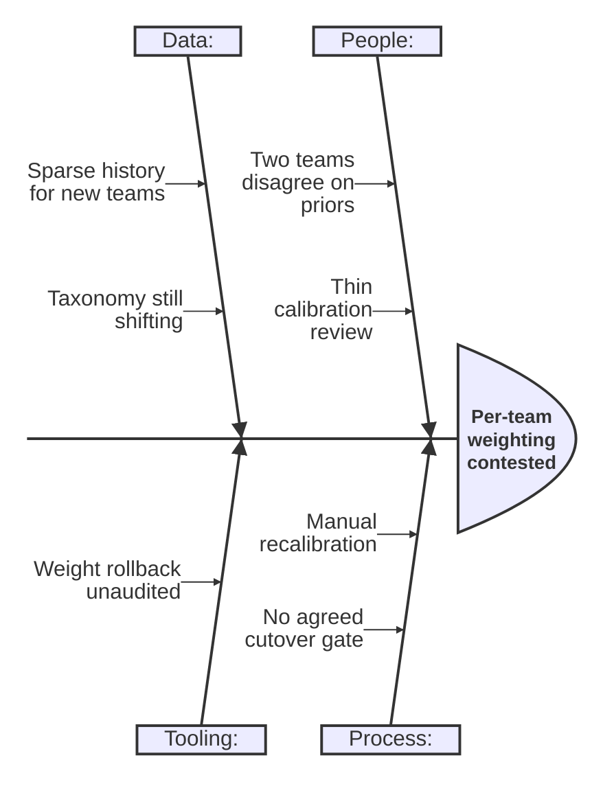

---

<!-- _class: diagram -->
<!-- _footer: "venn · diagram survey" -->

`Cause, set & history · Venn`

## Where the pilot audiences overlap.

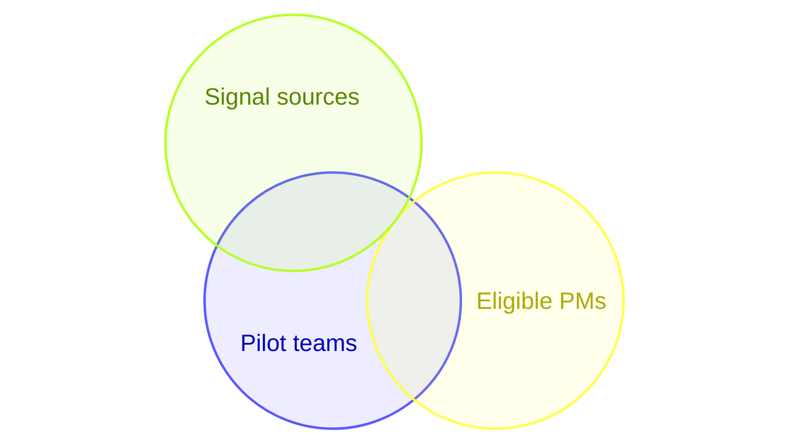

---

<!-- _class: diagram -->
<!-- _footer: "gitgraph · diagram survey" -->

`Cause, set & history · Git graph`

## How the scoring model reached v2.1.

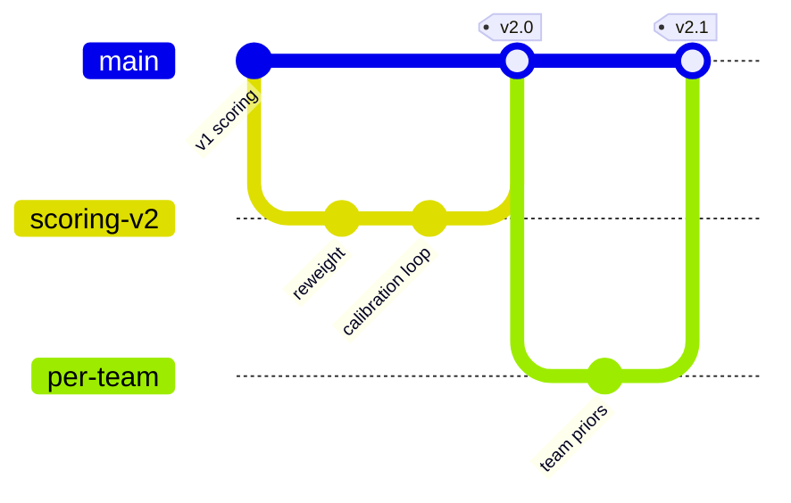

---

<!-- _class: compare-table -->
<!-- _footer: "synergy · prefer the native component" -->

`The chart handoff`

## When the shape is quantitative, use a native chart.

These shapes exist as both a Mermaid diagram and a native SVG-kernel component. Prefer the native one — it is themeable through tokens, lighter (no external renderer), and export-clean.

| When you have… | Mermaid would draw | Prefer this native component |
| --- | --- | --- |
| A dated plan or sequence of moments | gantt, timeline, journey | `gantt` · `timeline-list` · `roadmap` · `journey` |
| A proportion or a position on axes | pie, quadrant, radar | `piechart` · `quadrant` · `radar` |
| A board or a state machine | kanban, stateDiagram | `kanban` · `state-chart` |

---

<!-- _class: closing -->
<!-- _paginate: false -->
<!-- _footer: '' -->

`Diagrams · graph substance`

## Reach for a diagram when the graph is the slide.

*Fourteen relational shapes, one palette, one product. For plotted data — proportions, positions, dated plans, boards — the native chart family renders it lighter and fully themeable.*
