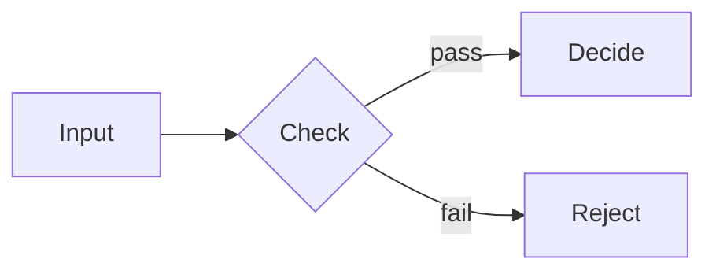

# mermaid

Draw a flowchart, sequence, state, class, entity-relationship, Gantt, pie, mind-map or any other
Mermaid diagram from a ` ```mermaid ` fence. The engine emits the fence as highlighted source; a
browser surface draws it with Mermaid, and the CLI export bakes it to a static SVG before the deck
renders, so a PDF, PNG, PPTX or `--player` carries a real drawing.

This is a **plugin** (`engineering/decisions/2026-09-27-plugin-system.md`). The `diagram` slide
class (`lib/components/diagram/diagram/diagram.docs.md`) is the layout built around it and declares
`"plugins": { "requires": ["mermaid"] }`; a fence works on any slide. The full authoring guide —
node shapes, theme matching, `%%{init}%%`, bands, motion — is `engineering/mermaid.md`.

## Authoring

````markdown
<!-- _class: diagram -->

## How signals move from input to decision.


````

`~~~mermaid` works too, as does a fence inside a list item. A fence inside a blockquote draws in a
browser but exports as its source on the CLI (a known gap, `lib/core/mermaid-fences.js`). A fence
inside an HTML comment — a speaker note, a commented-out draft — is not a diagram and is never drawn.

## Where it draws

| Surface | What it shows | Who draws it |
|---|---|---|
| engine (`render()`) | `<pre><code class="language-mermaid">`, highlighted | the engine's code renderer — the fence is declared `as: "code"` |
| Studio, Playground, `--fluid` | the diagram | the plugin's pass, `mermaid.hydrate.js`, driven by the runtime, with the library its `payload` names (`mermaid.min.js`, staged beside the runtime) |
| PDF, PNG, PPTX, an `.html` export, `--player` | a static `<div class="mermaid-svg">` | the plugin's bake, `mermaid.bake.js`, in a headless render worker |
| Export to Marp | the diagram | Mermaid in the recipient's browser (the bundle ships the library) |

Each diagram is drawn for the band of **its own slide** — light, dark or print — and in the
slide's look (a `mode: sketch` deck draws hand-drawn nodes). A portrait deck, or a tall pane,
turns a left-to-right flowchart top-to-bottom.

## Failure behavior

A definition Mermaid rejects never aborts a deck. In a browser the pass shows an error surface
with the parser's message and keeps the source. On the CLI the bake degrades that one diagram to
an escaped `<pre class="mermaid-fallback">` of its source; the rest of the deck's diagrams still
draw. If the render worker cannot run at all (no Chromium), each diagram is retried one at a time,
then falls back the same way. A bake that throws — a bug, not a bad diagram — fails the export,
and the CLI names the plugin.

## What the plugin contributes

- **`fences.mermaid`, `as: "code"`** — the fence is the plugin's (no other plugin may claim it, and
  it counts as use), but the engine renders it as the code block it always was.
- **`bake`, `render.exec.bake: "subprocess"`** — `mermaid.bake.js` exports `bake(source, ctx)`.
  The plugin host (`lib/plugins/host-bake.js`) runs it on the CLI before the engine, only for a
  deck that uses the plugin. It drives `lib/plugins/mermaid/shared/render-worker.js` in a child
  process, so the bake stays synchronous.
- **`hydrate`, `render.exec.hydrate: "pass"`** — `mermaid.hydrate.js` exports `createPass(ctx)`:
  the diagram pass every browser surface draws through, which the runtime drives (`boot`, `run`,
  `onMutations`) without naming Mermaid. A pass rather than a per-figure `hydrate(el, ctx)`,
  because `mermaid.initialize` is global: every fence is grouped by the palette its slide resolves
  and each band renders on one serial queue. It is bundled and never serialized, so it requires
  the kernels it shares with the bake. The resolver requires the bake for exactly this reason: the
  CLI export page carries no runtime.
- **`highlight`** — `mermaid.highlight.js` exports `highlight(hljs)`, the highlight.js grammar
  the host registers under ```` ```mermaid ````, so an undrawn or failed fence reads as colored source.
- **`styles`** — `mermaid.styles.css` is the plugin's stylesheet: the wrapper chrome, the settle
  states the anti-flash rules read, and the per-diagram overrides. Bundled in the plugin slot of
  `dist/lattice.css`; every `var(--…)` it reads is listed in the manifest's `tokens`.
- **The bake's context** — only the generic services in `BAKE_SERVICES` (`lib/plugins/host-bake.js`).
  The bake assembles Mermaid's theme variables itself (`themeFor`, with `ctx.paletteReader`) and publishes the generic re-bake hook, `ctx.state.rebake`, which the
  image-set export's cross-scheme look reads.

The render kernels both halves share live in two places. The plugin's OWN — the init directive,
the render worker, portrait reorientation and the motion roles — are in its `shared/` folder. The
ones other code also reads — `lib/core/render-diagrams.js`, `mermaid-theme-map.js`,
`diagram-scope.js`, `diagram-look.js` — stay where HARD RULE #1 put them; the plugin's modules are
the entry points onto them.

## See also

- `engineering/mermaid.md` — the authoring guide
- `lib/components/diagram/diagram/diagram.docs.md` — the slide class built around it
- `lib/plugins/README.md` — the plugin host
