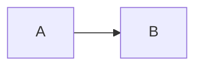
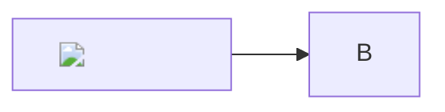

# mermaid — conformance fixtures

The plugin harness (`test/unit/plugins/conformance.test.js`) runs every case below. Each `##`
heading is one case: the ` ```markdown ` fence is the input, rendered by the engine, and each
bullet is an assertion about that render (`renders`, `omits`, `detect true|false`). The fence is
declared `as: "code"`, so the engine's output is the highlighted code block; the bake is exercised
by `test/unit/plugins/host-bake.test.js` and the integration tier (`test/integration/mermaid/`).

## a mermaid fence renders as its highlighted source

````markdown

````

- renders `<code class="language-mermaid">`
- renders `hljs-keyword`
- omits `data-lattice-hydrate`
- detect true

## a tilde fence is a diagram too

````markdown
~~~mermaid
sequenceDiagram
  A->>B: hi
~~~
````

- renders `language-mermaid`
- detect true

## a fence inside a blockquote is found

````markdown
> ```mermaid
> flowchart LR
>   A --> B
> ```
````

- renders `language-mermaid`
- detect true

## a mermaid-like name is not the fence

````markdown
```mermaidjs
flowchart LR
```
````

- omits `language-mermaid"`
- detect false

## source markup stays escaped

````markdown

````

- omits `<img src=x`
- detect true
