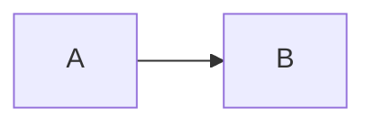

<!-- _class: diagram -->

## A flow



---

<!-- _class: math canvas -->

## A curve

$$y = x^2$$

```functionplot
{"data":[{"fn":"x^2"}]}
```

---

<!-- _class: math canvas -->

## The old fence name

$$y = x$$

```latticeplot
{"data":[{"fn":"x"}]}
```
