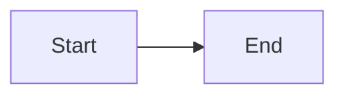

<!-- _class: piechart -->

`Fixture · keyed chart`

## A pie chart for SVG-extraction tests.

- Alpha `40%`
- Beta `35%`
- Gamma `25%`

---

<!-- _class: diagram -->

`Fixture · Mermaid diagram`

## A Mermaid flowchart for SVG-extraction tests.

