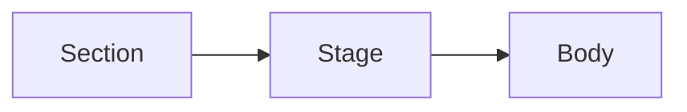

<!-- _class: title -->

# Chart fit fixture

Stress shapes for `tools/check-chart-fit.js` — every slide here must render with
its chart INSIDE the stage clip. These are the shapes that actually broke:
series counts around the row-wrap boundary, a name long enough to wrap the
caption band, and a below-note eating the stage.

---

<!-- _class: radar small-multiples -->

## Two series — the widest cell.

- Atlas
  - Speed `8`
  - Cost `6`
  - Risk `7`
- Beacon
  - Speed `5`
  - Cost `9`
  - Risk `4`

---

<!-- _class: radar small-multiples -->

## Four series — the four-up row the pad was tuned for.

- Atlas
  - Speed `8`
  - Cost `6`
  - Risk `7`
- Beacon
  - Speed `5`
  - Cost `9`
  - Risk `4`
- Cinder
  - Speed `7`
  - Cost `4`
  - Risk `8`
- Drift
  - Speed `6`
  - Cost `7`
  - Risk `5`

---

<!-- _class: radar small-multiples -->

## Six series with a wrapping name and a below-note.

- Northwind Logistics and Distribution Group
  - Speed `8`
  - Cost `6`
  - Risk `7`
- Atlas
  - Speed `5`
  - Cost `9`
  - Risk `4`
- Beacon
  - Speed `7`
  - Cost `4`
  - Risk `8`
- Cinder
  - Speed `6`
  - Cost `7`
  - Risk `5`
- Drift
  - Speed `4`
  - Cost `8`
  - Risk `6`
- Ember
  - Speed `9`
  - Cost `5`
  - Risk `3`

*A below-note, because the stage the row has to fit shrinks when one is present —
that is what tipped 5–8 series into clipping.*

---

<!-- _class: radar small-multiples -->

## Nine series — the far end of the grid.

- Atlas
  - Speed `8`
  - Cost `6`
  - Risk `7`
- Beacon
  - Speed `5`
  - Cost `9`
  - Risk `4`
- Cinder
  - Speed `7`
  - Cost `4`
  - Risk `8`
- Drift
  - Speed `6`
  - Cost `7`
  - Risk `5`
- Ember
  - Speed `4`
  - Cost `8`
  - Risk `6`
- Flint
  - Speed `9`
  - Cost `5`
  - Risk `3`
- Garnet
  - Speed `3`
  - Cost `7`
  - Risk `9`
- Harbor
  - Speed `8`
  - Cost `3`
  - Risk `5`
- Iris
  - Speed `6`
  - Cost `6`
  - Risk `6`

---

<!-- _class: word-cloud -->

## A word cloud, whose key sits in the rail here and below the cloud at portrait.

- execution `5`
- discipline `4.5`
- velocity `4`
- talent `3`
- risk `2`
- cadence `1`

---

<!-- _class: title -->

# Per-component coverage

One slide per chart component, so the gate sees the whole bucket rather than
only the shapes that broke above. The authoring mirrors
`lib/components/chart/chart.gallery.md` — the gallery is the live example, this
is the gate's stable copy of it (the gallery is long-running and moves; a gate
fixture must not).

`tools/check-chart-fit.js` renders this deck at landscape, portrait AND square,
so each slide below is really three cases.

---

<!-- _class: funnel -->

## The funnel narrows; the width is the story.

- Visitors `12,000`
  - Two-thirds arrive from inbound, not outbound
  - Paid search makes up the rest
- Signups `4,800`
- Activated `2,160`
- Paid `864`
- Renewed `670`

---

<!-- _class: gantt -->

`2026 Q1 .. 2026 Q4` `today Q3`

## The gantt lays the work against the calendar.

Three workstreams across four quarters; the one at-risk bar quietly gates the rollout.

- Framework
  - Signal taxonomy `Q1..Q2` `done`
  - Scoring model v2 `Q2..Q3` `live` `after: Signal taxonomy`
  - Per-team weighting `Q3..Q4` `at-risk` `after: Scoring model v2`
    - Two teams contest the weighting; the Q3 review decides it.
- Adoption
  - Pilot onboarding `Q1..Q2` `done`
  - Org-wide rollout `Q3..Q4` `after: Per-team weighting`
  - GA `Q4` `milestone` `after: Org-wide rollout`

---

<!-- _class: journey -->

## The journey scores each stage of the path.

- Evaluate
  - Read case study `@prospect` `:5`
  - Book demo `@prospect` `:4`
  - Live demo `@prospect` `@sales` `:4`
- Trial
  - Trial signup `@prospect` `:3`
  - Workspace setup `@user` `@onboarding` `:1`
- Activate
  - First report `@user` `:3`
  - Daily use `@user` `:5`

---

<!-- _class: kanban -->

## The board tracks cards across lanes.

- Backlog
  - Waiting cards `S`
- In progress
  - The active limit `M`
- Review
  - Almost done `S`
- Done
  - Shipped work `L`

---

<!-- _class: map -->

## The map fills regions by value.

- India `48.2`
  - Largest by volume, thinnest by margin
  - Two new state hubs this year
- Nigeria `36.4`
- Kenya `31.0`
- Brazil `27.5`
- Indonesia `19.3`
- Ethiopia `14.1`
- Bangladesh `11.8`
- Peru `9.6`

---

<!-- _class: matrix-grid -->

## The rubric puts a position in a cell.

Your title is the diagonal — the same verb at a wider reach is a different level.

<!-- The one chart this fixture never carried, and the gap cost what a gap costs
(#1620): matrix-grid's `table-layout: auto` table cannot render below its
min-content width, so `width: 100%` was a request the browser was free to ignore.
At portrait it ran 225.6px past its box with the Verb column cut; at story it was
cut SILENTLY, because that overflow lands inside `.chart-body`'s clip and never
reaches the slide edge for the corpus probe to see.

KEEP THE DEK TO ONE LINE. A six-row grid is height-tight, and an eight-line dek
clips it 169px at landscape and 555px at portrait — measured while writing this
slide. That is capacity, not a layout defect (the same class as #1600), and it is
not what this slide is here to watch. The table below is the committed gallery
matrix VERBATIM, so the gate measures the real reference content rather than a
reduced one that would fit either way. -->

`Wider reach`  `Deeper cognition`

| Verb | Self | Team | Org | Field |
| ---------- | :--: | :--: | :--: | :---: |
| Create     | [ ]  | [-]  | [-]  | [x] Distinguished |
| Evaluate   | [ ]  | [-]  | [x] Principal | [-] |
| Analyze    | [ ]  | [-]  | [x] Staff | [-] |
| Apply      | [-]  | [x] Senior | [-] | [ ] |
| Understand | [x] Mid | [-] | [ ] | [ ] |
| Remember   | [x] Junior | [-] | [ ] | [ ] |

---

<!-- _class: piechart -->

`H1 2026 · 1,840 person-hours`

## The pie gives each share one wedge.

Nearly half went to producing decks; the deciding itself was the smallest slice.

- Deck production `46%`
  - 92 decks, averaging 18 slides each
  - Most of it review-cycle churn
- Meetings about meetings `22%`
- Realigning on priorities `18%`
- Stakeholder management `9%`
- Actually deciding `5%`

---

<!-- _class: progress -->

`H1 2026 · Phase 1 readiness`

## Progress bars race toward their targets.

Snapshot at 14:00 UTC. Status pills reflect the most optimistic reading of the available data.

- Signal Intake `92%` `on-track`
- Scoring policy `68%` `at-risk`
- Decision Log `81%` `on-track`
- Calibration cadence `34%` `deferred`
- Adoption `12%` `blocked`

---

<!-- _class: quadrant -->

`Effort 0–10 → Reach 0–100`

## The quadrant scatters items on two axes.

Effort in analyst-weeks; reach as the percent of teams that would adopt it.

- Quick Wins
  - Weekly signal digest `2, 82`
  - Slack intake bot `3, 72`
- Strategic Bets
  - Scoring model v2 `8, 88`
    - Owner: Platform team
    - A 3-week spike de-risks the roadmap
  - Decision-log API `7, 74`
- Defer
  - Per-team weighting UI `2, 28`
  - Maturity self-assessment `1, 20`
- Time Sinks
  - Bespoke board exports `8, 18`
  - Custom calibration tooling `9, 26`

---

<!-- _class: radar -->

`Scale · 0–10`

## The radar maps strengths around the compass.

- Meridian
  - Performance `9`
    - Measured as p95 latency; lower is better
    - Our strongest axis against the field
  - Pricing `7`
  - Support `8`
  - Ecosystem `6`
  - Security `9`
- Vantage
  - Performance `7`
  - Pricing `8`
  - Support `6`
  - Ecosystem `9`
  - Security `7`
- Helios
  - Performance `6`
  - Pricing `9`
  - Support `7`
  - Ecosystem `8`
  - Security `8`

---

<!-- _class: roadmap -->

`H2 2026 · Rollout plan`

## The roadmap grids workstreams against phases.

| Workstream | Foundation `Q2 2026`   | Hardening `Q3 2026`      | Scale `Q4 2026`         |
| ---------- | ---------------------- | ------------------------ | ----------------------- |
| Framework  | [x] Signal taxonomy    | [-] Scoring model v2     | [ ] Per-team weighting  |
| Adoption   | [x] Pilot onboarding   | [-] Weekly signal review | [ ] Org-wide rollout    |
| Governance | [x] Decision log       | [x] Calibration cadence  | [ ] Board reporting     |
| Tooling    | [x] Intake form        | [/] Dashboards           | [ ] Self-serve exports  |

---

<!-- _class: state-chart lr -->

`Submission lifecycle`

## States connect; the arrows carry the rules.

How a draft moves from author to publication.

1. Draft `start`
   - `submit => 2`
2. Submitted `on-track`
   - `review => 3`
3. In Review `at-risk`
   - `approve => 4`
   - `reject => 1`
   - `revise => self`
   - Two reviewers must sign off before approval.
4. Approved
   - `publish => 5`
5. Published `end`

*Rejected drafts return to the author; revisions stay in review.*

---

<!-- _class: timeline-list -->

## The timeline pins events to their dates.

Four milestones show the shape; the date chips carry the when.

1. `Q1` The first milestone
   - One clause says what changed here.
2. `Q2` The second, marked `decision`
   - A tag names the milestone's kind.
3. `Q3` The third milestone
   - Sixteen words is each entry's budget.
4. `Q4` The fourth milestone
   - Four to six entries reads best.

---

<!-- _class: word-cloud -->

## Weight is meaning in a word cloud.

- time-to-value `5`
- security `4`
- onboarding `4`
- pricing `3`
- integrations `3`
- support `2`
- roadmap `2`
- contracts `1`
- residency `1`

---

<!-- _class: diagram -->

## A diagram is a body in a stage cell too.

The inset assertion (#1598) governs every bucket with a stage, not just the
charts — so the fixture carries one diagram, and the `.mermaid-svg` arm of the
body selector is exercised by the shipped gate rather than only by hand-pointing
it at `diagram.gallery.md`. A `<blockquote>` sibling below is the case that made
diagram's second inset visible: it always sat at the frame inset while the
diagram sat 64px inside it.

> The body, the dek and this panel share one left edge.

---

<!-- _class: timeline-list no-form -->

## A chart with no Form still has a holder.

`no-form` (per slide) and `form: off` (per deck) are supported opt-outs, and on
that path there is no `.cell-stage` — the SECTION holds the body, so the section
owns the inset. This slide is here because the inset assertion used to skip a
stage-less section entirely, and that is the exact path #1598's first cut
regressed on.

1. `Q1` The first milestone
   - One clause says what changed here.
2. `Q2` The second, marked `decision`
   - A tag names the milestone's kind.
3. `Q3` The third milestone
   - Sixteen words is each entry's budget.

---

<!-- _class: kanban claim-bleed -->

## A bleeding chart still has a floor.

**This slide lints as a warning ON PURPOSE — `claim-bleed-unsafe` — and that is
the point of it.** kanban now declares `"excludes": ["claim-bleed"]`, so an author
is warned off to `claim-hero`. But a warning is not an error: the deck still
renders, and until #1598 it rendered SLICED, because the chart's own 64px inset
had been silently flooring a bleed nothing ever tested. The floor is now explicit,
and this slide is what proves it holds for the author who bleeds one anyway. No
committed deck combines a chart with `claim-bleed`, which is exactly why nothing
caught the regression.

- Backlog
  - Waiting cards `S`
- In progress
  - The active limit `M`
- Review
  - Almost done `S`
- Done
  - Shipped work `L`

---

<!-- _class: quadrant canvas -->

`Effort 0–10 → Reach 0–100`

## A painted panel is the one body that earns an inset.

The opt-in glass canvas paints a surface on `.chart-body`, so §6.1's second
clause applies and its inline padding is legitimate — the gate proves that by
MEASUREMENT (a non-transparent background) rather than by a class list. This
slide is the only committed coverage of the `canvas` modifier; without it the
panel's inset chain had no gate at all.

- Quick Wins
  - Weekly signal digest `2, 82`
  - Slack intake bot `3, 72`
- Strategic Bets
  - Scoring model v2 `8, 88`
  - Decision-log API `7, 74`
- Defer
  - Per-team weighting UI `2, 28`
- Time Sinks
  - Bespoke board exports `8, 18`

---

<!-- _class: timeline-list canvas -->

## The one per-chart panel tuning.

1. `Q1` The first milestone
2. `Q2` The second, marked `decision`
3. `Q3` The third milestone

<!-- The `quadrant canvas` slide above is a height-bound SVG on the FAMILY panel
default, so it cannot see a PER-CHART one. timeline-list is the only chart that
has one (`--chart-panel-x` at tall/strip), and deleting an inline token silently
retuned it 3x tighter until the trio caught it — twice, independently. This slide
is what watches it now. Kept deliberately short: `timeline-list canvas` at
portrait is height-tight on `main` too, and this fixture is here to exercise the
panel token, not to re-litigate that. -->
