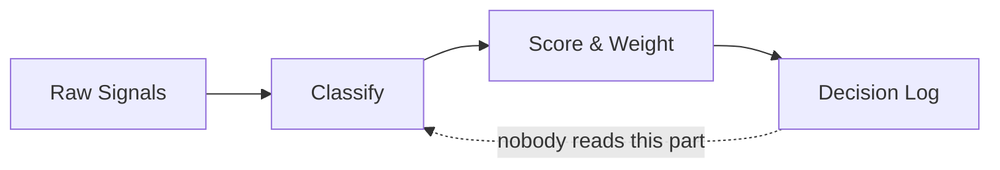

<!-- _class: title silent -->

# Export-surface coverage deck

`Fixture · capture-sensitive components`

Every component family the browser export rasterizer has historically mishandled, on one short deck: stylesheet-styled chart SVGs (radar, donut, funnel, quadrant), a self-styled Mermaid diagram, the spectrum-ribbon content chrome, and a dark solid-canvas bookend. Render it through the REAL Share → PDF whenever the export pipeline changes, and actually look at every page (engineering/visual-review.md § The export surface).

---

<!-- _class: content -->
<!-- _footer: "Spectrum ribbon + text chrome · content" -->

## The plain-HTML control slide

- Ribbon and chrome
  - The gradient border-top is repainted as a background strip at capture time; this slide proves the repaint still lands.
- Type and tokens
  - Body copy, `inline code`, and **bold runs** pin the font-embed path — a fallback face here means the data-URI @font-face block broke.

---

<!-- _class: diagram -->
<!-- _footer: "Component diagram · diagram" -->

`Architecture · Signal Pipeline`

## How signals move from input to decision

`Four-stage pipeline — 11 weeks in, still in pilot`

---

<!-- _class: funnel -->
<!-- _footer: "Pipeline drop-off · funnel" -->

## How a week of signals narrows to one logged decision

- Signals collected `1,840`
- Passed classification `1,180`
- Scored above threshold `420`
- Surfaced in the weekly brief `90`
- Logged as a decision `18`

---

<!-- _class: radar -->
<!-- _footer: "Spider comparison · radar" -->

`Scale · 0–10, on the criteria we wrote`

## The four tools, scored across the criteria we wrote

- Chorus
  - Speed `9`
  - Auditability `2`
  - Adoption `8`
  - Calibration `1`
  - Exposes weights `1`
- Notion
  - Speed `7`
  - Auditability `8`
  - Adoption `3`
  - Calibration `2`
  - Exposes weights `2`
- Sprig + Log
  - Speed `9`
  - Auditability `9`
  - Adoption `8`
  - Calibration `9`
  - Exposes weights `10`

---

<!-- _class: piechart donut -->
<!-- _footer: "SVG donut with legend · piechart donut" -->

`H1 2026 · 1,840 person-hours`

## Where the engineering quarter went

The "Toil and on-call" wedge is the one nobody put in the roadmap.

- Signal Intake build `46%`
- Scoring policy work `22%`
- Decision Log integration `18%`
- Explaining the framework to stakeholders `9%`
- Toil and on-call `5%`

Last updated 2026-05-07 · the 9% is probably higher

---

<!-- _class: quadrant -->
<!-- _footer: "Two-axis scatter · quadrant" -->

`Confidence 0–10 → Impact 0–10`

## Where the 18 logged decisions landed

- After the fact
  - Reprioritized the roadmap `2, 7`
  - Picked the vendor `1, 6`
  - Killed the connector rewrite `4, 8`
- Predicted
  - Cut the onboarding step `7, 7`
  - Renamed the tier labels `8, 8`
- Calibrated
  - Adjusted recency weight `3, 2`

---

<!-- _class: closing -->
<!-- _paginate: false -->
<!-- _header: '' -->
<!-- _footer: '' -->

## Dark bookend — solid canvas, light type.

`If this page exports white, the no-backgroundColor rule regressed.`
