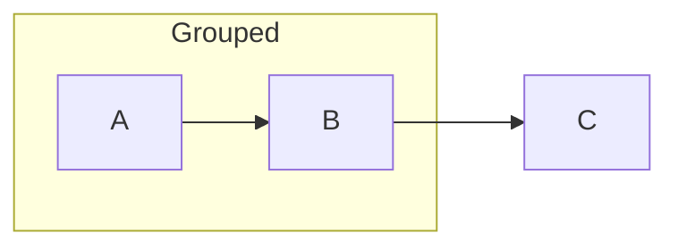
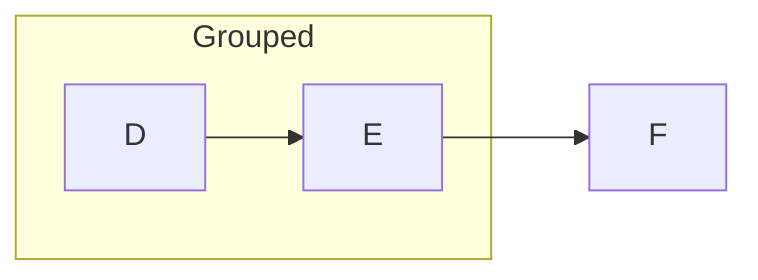
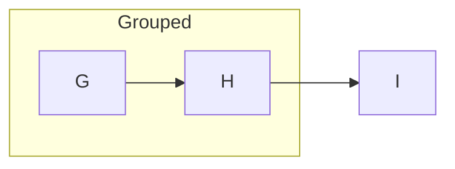

<!-- _class: diagram -->

## A component class is not an opt-out of the deck's color mode.

---

<!-- _class: diagram light -->

## A slide's own `light` token does opt out.

---

<!-- _class: diagram dark -->

## A slide's own `dark` token agrees with the deck.

