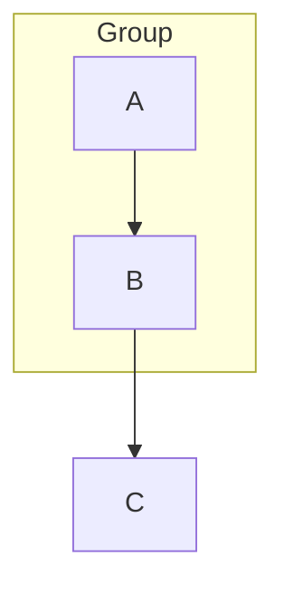
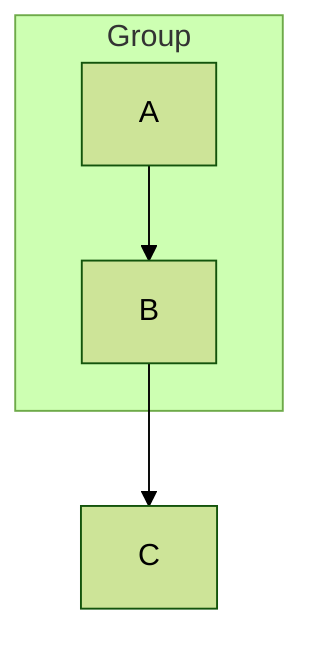

<!-- _class: diagram -->

## Control

```mermaid
flowchart TB
  subgraph g["Group"]
    A["A"] --> B["B"]
  end
  B --> C["C"]
```

---

<!-- _class: diagram -->

## Color-neutral init directive

```mermaid
%%{init: {'flowchart': {'curve': 'linear'}}}%%
flowchart TB
  subgraph g["Group"]
    A["A"] --> B["B"]
  end
  B --> C["C"]
```

---

<!-- _class: diagram -->

## Author-pinned Mermaid theme

```mermaid
%%{init: {'theme':'forest'}}%%
flowchart TB
  subgraph g["Group"]
    A["A"] --> B["B"]
  end
  B --> C["C"]
```
