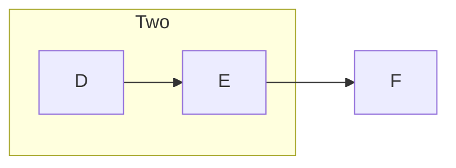
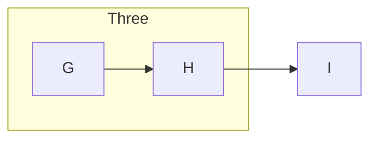
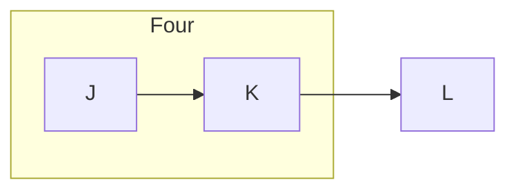
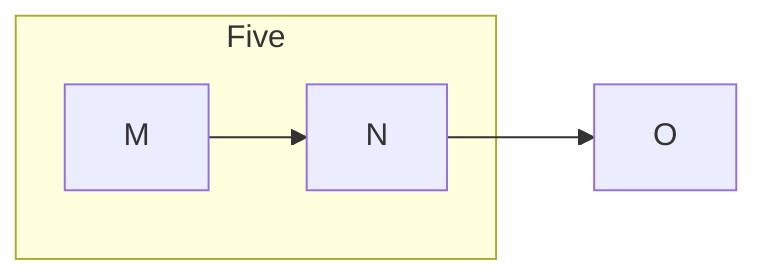

<!-- _class: diagram -->

## The deck default reaches a slide that names no color token.

---

<!-- class: diagram dark -->

## A GLOBAL class directive applies from its own slide.

---

## And it carries forward to a slide that declares nothing.

---

<!-- _class: diagram dark -->

## A directive quoted as prose is prose.

- `<!-- _class: kpi -->` is how the docs name a layout, not a layout change.

---

<!-- _class: diagram dark -->

## An equation is opaque, and does not start a slide.

$$
A
=
LU
$$

