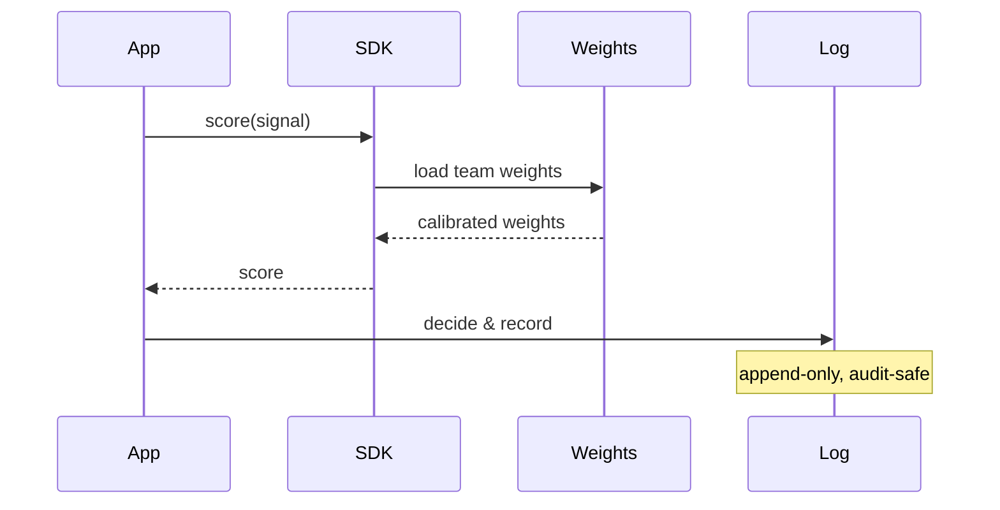

<!-- _class: diagram dark -->
<!-- _footer: "sequence · diagram survey" -->

`Flow & sequence · Sequence`

## The score-and-decide handshake, actor by actor.

```mermaid
sequenceDiagram
  participant App
  participant SDK
  participant Weights
  participant Log
  App->>SDK: score(signal)
  SDK->>Weights: load team weights
  Weights-->>SDK: calibrated weights
  SDK-->>App: score
  App->>Log: decide & record
  Note over Log: append-only, audit-safe
```
