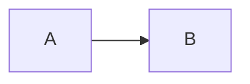

# Preprocessed Fixture

This deck exists to prove the PDF attachment is cut under a boundary measured on the
document it actually ships. The Mermaid fence below is what makes that document differ
from the one the export renders.

---

## The note sits inside a list item

- Revenue up 12 percent
  <!-- PREPROCLEAKTOKEN alpha: the author's private remark, inside the list. -->
- Costs flat
- Headcount steady

---

## Closing

Every number above is made up.
