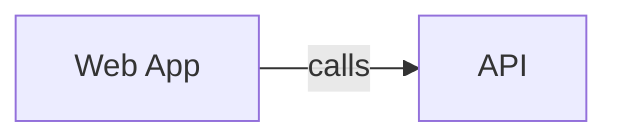
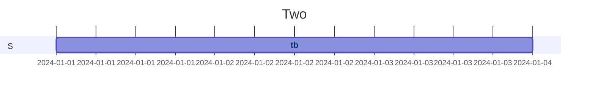

<!-- _class: diagram -->

## Linked flow

```mermaid
flowchart LR
  A["Web App"] -->|calls| B["API"]
  click B "https://example.com/api" "Opens the API reference"
```

---

## Two plans

```mermaid
gantt
  dateFormat YYYY-MM-DD
  title One
  section S
  ta :ta, 2024-01-01, 3d
  click ta href "https://one.example/"
```

```mermaid
gantt
  dateFormat YYYY-MM-DD
  title Two
  section S
  tb :tb, 2024-01-01, 3d
  click tb href "https://two.example/"
```

Notes
